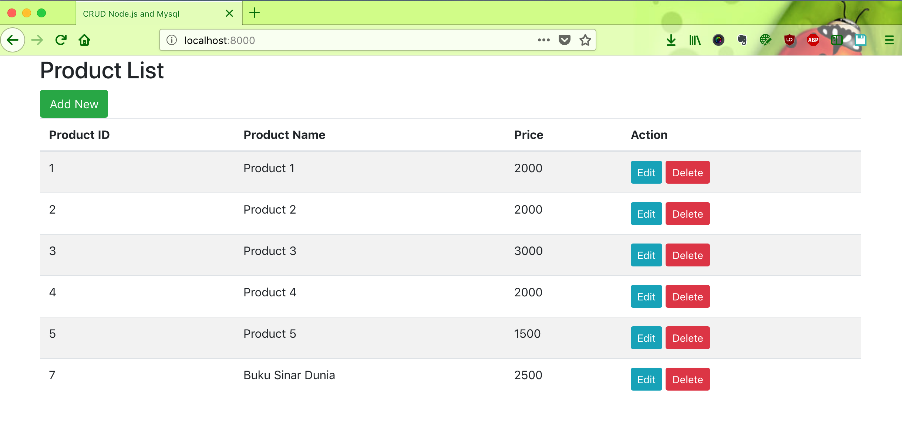
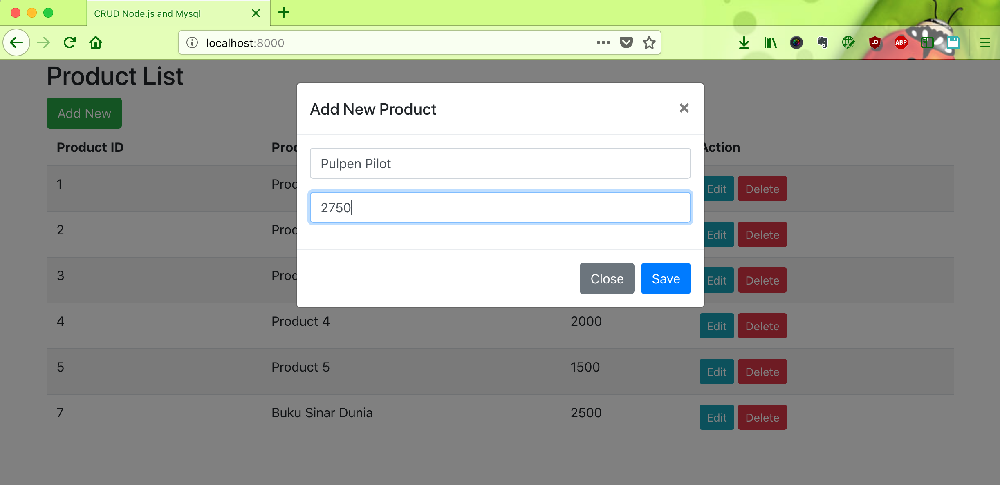
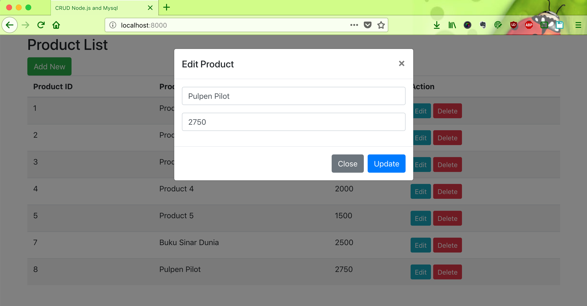

# crud-bootstrap-mysql-nodejs

Run this project by this command : 
1. `npm install --save express mysql body-parser hbs`
2. `node index`

#### Screenshot

Home Page

Add New Product Page

Edit Product Page

